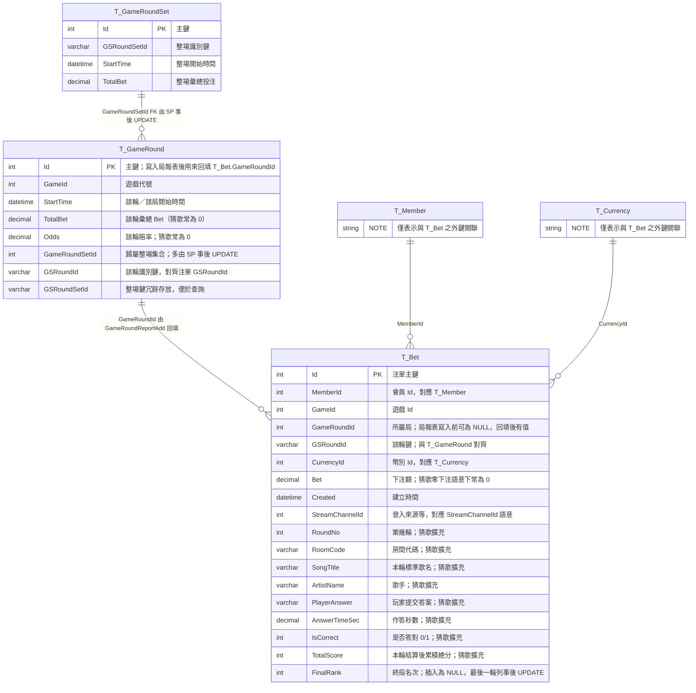

# 猜歌遊戲報表／T_Bet 擴充 — 異動說明

本文檔說明 **GuessSong（猜歌）** 將「每人每輪得分與戰績明細」寫入資料庫時，於 **schema、預存程序、GameServer** 所做的一次性擴充。若之後還要改程式，建議先更新本文與 [GameServer_DBAccess_SPReport.md](GameServer_DBAccess_SPReport.md)，再動程式碼。

---

## 1. 背景與目標

### 1.1 問題

原有 `battle` schema 中 `T_Bet` 僅涵蓋注單／財務語意（`Bet`、`Payout`、`WinLose` 等），無法對齊客端協定 `gsrr`／`gsfr` 的完整資訊，例如：

- 累積總分、是否答對、作答時間、玩家提交的答案  
- 標準歌名與歌手、第幾輪、房間代碼  
- 終局名次  

### 1.2 目標

在 **不改變 Rocket／其他遊戲既有呼叫慣例** 的前提下：

1. 擴充 `T_Bet` 欄位，保存猜歌明細。  
2. 擴充 `sp_Game_MemberReportAdd`（新參數預設 `NULL`，舊客戶端仍只傳 12 個參數）。  
3. 新增 `sp_Game_MemberBetSetFinalRank`，於整場結束後回填最後一輪注單的 `FinalRank`。  
4. 在 GameServer 每輪結算與終局結算時帶入對應值，並經 XPG Adapter API 的 JSON（或日後直連 MySQL）寫庫。

### 1.3 設計取捨：多遊戲共用 `T_Bet`

**既有 `T_Bet` 的語意**較接近德州撲克等「注單／財務」模型（`Bet`、`Payout`、`WinLose` 等）。**猜歌**在同一張表上沿用同一條寫庫管線，但實際欄位意義不同（例如零下注時 `Bet=0`、本輪得分落在 `Payout`／`WinLose` 的約定），屬 **以 `GameId`（或遊戲種類）區分語意** 的做法。

- **繼續把新遊戲寫進 `T_Bet` 的優點**：報表或營運統計可從**同一張主表**（搭配 `GameId` 過濾）撈取跨遊戲活動；亦較易沿用既有 Adapter、`sp_Game_MemberReportAdd` 等路徑，工程成本低。
- **缺點與風險**：不同遊戲對同一欄位的解讀可能不同，文件與報表必須寫清楚；若每加一款就堆一批**僅該遊戲有意義**的可空欄位、或一再擴充 SP 參數，長期會難以維護。
- **本專案現況**：在**款式數有限、欄位仍可控**的前提下，於 `T_Bet` 上擴充猜歌專用欄位屬合理演進。
- **後續演進建議**：若**預期還會多款、且各遊戲欄位分支變多**，宜改為 **`T_Bet` 保留共用的注單殼**（會員、遊戲、局／輪、時間、幣別、財務摘要等），**遊戲專屬明細移至副表**（例如 `BetId` 外鍵、`T_BetGuessSong` 之類）；跨遊戲統計仍可透過 **VIEW、報表寬表或數倉** 做成「查詢上仍像一張表」，而不必讓 OLTP 單表承載全部語意。

---

## 2. 資料庫異動

### 2.0 與報表寫入直接相關的三張表（摘自 schema）

此寫法的風格：**主表方塊只列重點欄位**、**關聯線上帶中文說明**；`T_Member`／`T_Currency` 以小方塊附 **`NOTE` 假欄位**（僅說明外鍵語意，不代表實際表僅一欄；假欄位名須 ASCII 方可通過 Mermaid 10.9.x 解析）。欄位尾端雙引號為 Mermaid 內建註解，渲染時通常顯示在欄位旁／第二欄說明。

- **圖示說明**：`T_Bet` 圖中已含 **修後** 猜歌擴充欄位（`RoundNo`～`FinalRank`）；其餘財務欄位（`BetTime`、`SettleTime`、`Payout`、`WinLose`、`Rake`、`Odds` 等）實際在 [temp/battle.sql](temp/battle.sql) 仍存在，此處為版面精簡未畫出。
- `T_Bet`（約 605–622 行）：注單；**修前**僅至 `StreamChannelId` 與財務欄位，無猜歌明細；修後見上圖與 §2.1。
- `T_GameRound`（約 1071–1087 行）：單一「回合／局」彙總；原始版本沒有 `Round` 序號、`SongAnswer`、`CorrectCount`（與 `GuessSongLobbyAdapter.Report.cs` 送往 API 的 JSON 延伸欄位不一致）。
- `T_GameRoundSet`（約 1093–1105 行）：整場集合；由 `sp_Game_GameRoundSetReportAdd` 插入後，再 `UPDATE T_GameRound SET GameRoundSetId = ... WHERE GSRoundSetId = ...`。

### 2.1 資料表 `T_Bet`

**修改前（概念）**：至 `StreamChannelId` 為止，無猜歌專用欄位。

**修改後** — 在 `StreamChannelId` 之後新增：

| 欄位 | 型別 | 說明 |
|------|------|------|
| `RoundNo` | `int` NULL | 第幾輪 |
| `RoomCode` | `varchar(32)` NULL | 房間代碼（如 `ZNWG8C`） |
| `SongTitle` | `varchar(500)` NULL | 本輪標準歌名 |
| `ArtistName` | `varchar(500)` NULL | 歌手 |
| `PlayerAnswer` | `varchar(500)` NULL | 玩家提交的答案 |
| `AnswerTimeSec` | `decimal(12,4)` NULL | 作答時間（秒） |
| `IsCorrect` | `tinyint(1)` NULL | 本輪是否答對（0/1） |
| `TotalScore` | `int` NULL | **本輪結算後**之累積總分 |
| `FinalRank` | `int` NULL | 終局名次；插入時為 `NULL`，最後一輪之 `GSRoundId` 列事後 `UPDATE` |

**注意**：`T_Bet` 仍保留原有財務欄位。猜歌零下注約定仍適用：`Bet=0`，本輪得分可放在 `Payout`／`WinLose`（與 [GameServer_DBAccess_SPReport.md](GameServer_DBAccess_SPReport.md) §10 一致）。

### 2.2 預存程序 `sp_Game_MemberReportAdd`

- **修改前**：12 個 `IN` 參數；`INSERT` 僅寫入原有欄位。  
- **修改後**：在 `p_StreamChannelId` 之後再增加 8 個參數，且皆 **`DEFAULT NULL`**：

  - `p_RoundNo`、`p_RoomCode`、`p_SongTitle`、`p_ArtistName`、`p_PlayerAnswer`、`p_AnswerTimeSec`、`p_IsCorrect`、`p_TotalScore`

- `INSERT` 時一併寫入上表新欄位；`FinalRank` 固定插 `NULL`（由後續程序更新）。

**相容性**：Rocket／掃雷等若仍只以 **12 個參數** 呼叫（或由 Adapter 只組出 12 個），在 **MySQL 8** 下尾端參數使用預設，新欄位為 `NULL`，不影響既有注單語意。

### 2.2.1 示意：一場房（5 輪、3 人）寫入後「預期長相」

假設：

- `GSRoundSetId = "GS-ZNWG8C-20260325"`（一整場）
- 第 `r` 輪 `GSRoundId = "GS-ZNWG8C-20260325_r"`
- `GameId = 100`（示意）
- `CurrencyId` 由幣別代碼解析
- `Bet=0`，`Payout = roundScore`，`WinLose = roundScore`（僅示意）

第 2 輪結算後（與先前 log 對齊）：

`T_Bet`（3 列，插入時 `GameRoundId` 為 `NULL`；執行 `GameRoundReportAdd` 後三列的 `GameRoundId` 皆為同一新 `T_GameRound.Id`，例如 `227601`。以下欄位為**修後結構**）：

| MemberId | GameId | GameRoundId | GSRoundId | Bet | Payout | WinLose | Rake | Odds | StreamChannelId | RoundNo | RoomCode | SongTitle | ArtistName | PlayerAnswer | AnswerTimeSec | IsCorrect | TotalScore | FinalRank | 備註 |
|---|---:|---:|---|---:|---:|---:|---:|---:|---|---:|---|---|---|---|---:|---:|---:|---:|---|
| 11 | 100 | 227601 | GS-ZNWG8C-20260325_2 | 0 | 155 | 155 | 0 | 0 | LoginSource | 2 | ZNWG8C | 第三人稱 | JOLIN蔡依林 | 第三人稱 | 15.1209 | 1 | 155 | NULL | 示意：玩家 test1（memberId 11）；答對且本輪得分較高；此輪結算後累積分 155。`FinalRank` 待最後一輪後回填。 |
| 12 | 100 | 227601 | GS-ZNWG8C-20260325_2 | 0 | 137 | 137 | 0 | 0 | ... | 2 | ZNWG8C | 第三人稱 | JOLIN蔡依林 | 第三人稱 | 21.4277 | 1 | 137 | NULL | 示意：玩家 test2／暱稱阿明2；答對但較晚提交故本輪分較低。 |
| 13 | 100 | 227601 | GS-ZNWG8C-20260325_2 | 0 | 0 | 0 | 0 | 0 | ... | 2 | ZNWG8C | 第三人稱 | JOLIN蔡依林 | （未作答／空字串） | 0.0000 | 0 | 0 | NULL | 示意：玩家 test3／阿明3；逾時或未送 `gsa` 時多為答錯、時間 0、得分 0。 |

`T_GameRound`（該輪 1 列，`TotalBet`/`TotalPayout`/`WinLose` 為該輪彙總，需由 GameServer 加總後傳入 SP）：

| GameId | GSRoundId | GSRoundSetId | TotalBet | TotalPayout | WinLose | ... | 備註 |
|---:|---|---|---:|---:|---:|---|---|
| 100 | GS-ZNWG8C-20260325_2 | GS-ZNWG8C-20260325 | 0 | 292 | 292 | … | 本輪三人 `Payout` 加總 155+137+0=292；`TotalBet=0` 為猜歌零下注約定；其餘欄位見 `battle.sql`。 |

上列數字為示意：`155 + 137 + 0`；實際以你們彙總規則為準。

整場結束後，`FinalRank` 會由 `sp_Game_MemberBetSetFinalRank` 對**最後一輪**的 `GSRoundId`（例如 `GS-ZNWG8C-20260325_5`）回填為 1/2/3；第 2 輪這三筆仍維持 `NULL` 屬正常行為。

### 2.3 新預存程序 `sp_Game_MemberBetSetFinalRank`

- **用途**：`UPDATE T_Bet SET FinalRank = p_FinalRank WHERE MemberId = p_MemberId AND GSRoundId = p_GSRoundId`  
- **呼叫時機**：整場遊戲結束、名次已確定後，針對 **最後一輪** 的 `GSRoundId` 逐位會員更新。

### 2.4 檔案與部署方式

| 用途 | 檔案 | 備註 |
|------|------|------|
| **既有資料庫** incremental | [temp/battle_T_Bet_guesssong_migration.sql](temp/battle_T_Bet_guesssong_migration.sql) | 上線前備份；於維護視窗執行 `ALTER`／`DROP CREATE PROCEDURE`。 |
| **全新還原／基線** | [temp/battle.sql](temp/battle.sql) 內已同步 `CREATE TABLE T_Bet` 與相關 `PROCEDURE` | 僅供新建庫或全庫重建；勿覆蓋含正式資料的既有 instance。 |

執行 migration 前請備份；確認環境為 **MySQL 8**（與預設參數語法相容）。

---

## 3. GameServer 程式異動

### 3.1 涉及的檔案

| 檔案 | 變更摘要 | 備註 |
|------|----------|------|
| [GameServer/Content/GuessSong/GuessSongLobbyAdapter.Report.cs](GameServer/Content/GuessSong/GuessSongLobbyAdapter.Report.cs) | `DbPara_GuessSongMemberReport` 新增：`RoundNo`、`RoomCode`、`SongTitle`、`ArtistName`、`PlayerAnswer`、`AnswerTimeSec`；`writeMemberReport_ByXpgApi` 的 JSON 一併送出；新增 `WriteGuessSongMemberBetFinalRank`（呼叫 `Report/MemberBetSetFinalRank`）。 | Adapter 端須能轉遞新 JSON 欄位至 SP 參數；否則 DB 新欄會一直是 `NULL`。 |
| [GameServer/Content/GuessSong/GuessSong.cs](GameServer/Content/GuessSong/GuessSong.cs) | `writeRoundDbReports()` 組裝並傳入上述明細；`SettleFinal()` 結尾呼叫 `writeFinalRankDbReports()`，依最後一輪 `GSRoundId` 回填名次。 | 順序須維持：先每人 `MemberReportAdd`，再該輪 `GameRoundReportAdd`，名次在最後一輪後補寫。 |
| [GameServer/Content/GuessSong/GuessSong.Command.cs](GameServer/Content/GuessSong/GuessSong.Command.cs) | 房主 `gsst` 時設定 `m_reportSequenceId`（整場鍵／對應 `GSRoundSetId` 語意之字串），供每輪 `GSRoundId = SequenceID + "_" + 輪次` 使用。 | `SequenceID` 格式需全場一致，才便於 `GameRoundSetReportAdd`／`FinalRank` 與報表以 `GSRoundSetId` 串關。 |

### 3.2 每輪與終局的寫入順序（仍須遵守）

1. 該輪每位在房玩家各一次 **個人報表**（`WriteMemberReport` → `MemberReportAdd`）。  
2. 該輪一次 **局報表**（`WriteInningReport` → `GameRoundReportAdd`），以便 `sp_Game_GameRoundReportAdd` 依 `GSRoundId` 回填 `T_Bet.GameRoundId`。  

終局另：

3. 對最後一輪之 `GSRoundId`，每位玩家一次 **`MemberBetSetFinalRank`**（或直連 `sp_Game_MemberBetSetFinalRank`）。

### 3.3 與客端 log 的對應（範例語意）

- `gsrr.myResult.totalScore` → `T_Bet.TotalScore`（該輪結算後）。  
- `gsrr.myResult.isCorrect` → `IsCorrect`。  
- `gsrr.myResult.answerTime` → `AnswerTimeSec`。  
- 玩家送出之答案 → `PlayerAnswer`；公布之標準答案 → `SongTitle`；歌手 → `ArtistName`。  
- `gsgi`/`gscr` 房間代碼 → `RoomCode`。  
- 輪次 → `RoundNo`。  
- `gsfr.myRank` → 僅在最後一輪對應之 `GSRoundId` 列更新 `FinalRank`。

---

## 4. XPG Adapter API（pk-game-adapter）須配合事項

GameServer 目前假設：

1. **`POST .../Report/MemberReportAdd`**  
   - 除原有欄位外，可接收（並轉成 SP 參數）：`RoundNo`、`RoomCode`、`SongTitle`、`ArtistName`、`PlayerAnswer`、`AnswerTimeSec`；既有 `TotalScore`、`IsCorrect` 應對應至 **`p_TotalScore`、`p_IsCorrect`** 等。  

2. **`POST .../Report/MemberBetSetFinalRank`**（**新路徑**）  
   - Body：`MemberId`、`GSRoundId`、`FinalRank` → 呼叫 `sp_Game_MemberBetSetFinalRank`。  

若 API 尚未實作，GameServer 可能記錯誤 log；DB 端可先以 `CALL` 手動驗證 migration 與 SP。

---

## 5. 文件與清單交叉參考

- 總體對照與 checklist：[GameServer_DBAccess_SPReport.md](GameServer_DBAccess_SPReport.md)（含 **§10～§12** 猜歌鍵名、映射、修改前後表）。  

---

## 6. 安全與維運

- 資料庫連線帳密應放在設定或秘密管理，**勿**寫入版控或貼於公開通道。  
- 變更 `sp_Game_MemberReportAdd` 後，建議在測試環境驗證：**Rocket 一筆注單**、**猜歌一輪多人**、**猜歌終局名次更新** 三種路徑。  

---

## 7. 修訂紀錄

| 日期 | 說明 |
|------|------|
| 2026-03-25 | 初版：`T_Bet` 擴充、`sp_Game_MemberReportAdd`／`sp_Game_MemberBetSetFinalRank`、GuessSong GameServer 與 API 預期行為；並補充 §1.3 多遊戲共用 `T_Bet` 之設計取捨與後續拆副表之演進方向。 |
