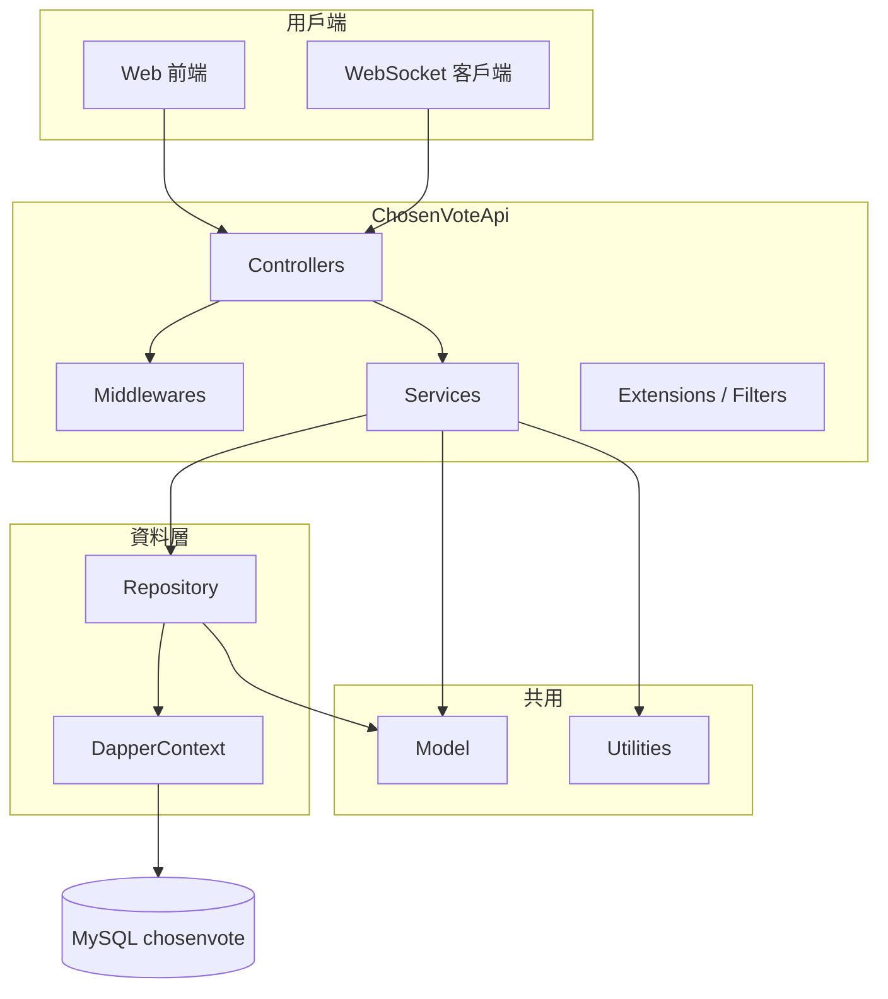
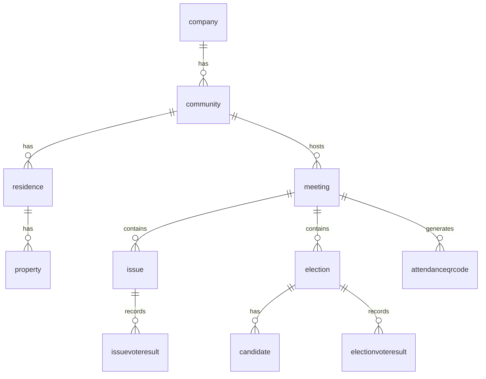

| 項目 | 說明 |
|------|------|
| 文件版本 | 1.0 |
| 對應程式 | `code/slnChosenVoteApi.sln` |
| 資料庫 | MySQL，結構見 `document/ChosenVote-schema.sql` |
| 相關分析 | `document/專案分析彙整.md` |
| 架構說明 | `document/SA-天選選務系統-軟體架構.md` |
| 需求參考 | `document/004_202409_合滙_天選選務系統`（草稿） |

---

## 1. 目的與範圍

### 1.1 目的

本文件描述 **ChosenVote 後端 API** 之系統設計：分層架構、主要模組職責、關鍵資料流、與資料庫之對應關係，供開發、維運與後續擴充使用。

### 1.2 範圍

- **包含**：Web API、中介軟體、業務服務層、Repository、共用模型、WebSocket 即時通道、與 MySQL 之互動模式。
- **不包含**：前端 SPA/行動 App 之畫面與路由（除非與 API 契約直接相關）；未在程式庫內實作之商業模組（如完整計費系統）。

---

## 2. 系統情境

### 2.1 角色

| 角色 | 說明 |
|------|------|
| 系統管理員 | `systemmanager` 等帳號維度 |
| 組織/社區管理者 | `company` / `companymanager` / `community` |
| 住戶／區分所有權人 | `residence` / `property` |
| 現場工作人員／裝置 | 透過 QRCode、裝置綁定與報到流程操作 |

### 2.2 外部系統

| 類型 | 說明 |
|------|------|
| MySQL | 主要資料儲存 |
| SMTP | 透過 `SendEmailService` 寄送郵件（註冊驗證、忘記密碼等） |
| 前端應用 | 讀取 `FrontendConfig` 等設定之 BaseUrl，用於郵件內連結 |

---

## 3. 邏輯架構

### 3.1 分層

- **Controllers**：HTTP 契約、參數綁定、授權呼叫點。
- **Services**：業務規則、交易邊界、跨 Repository 協調。
- **Repository**：SQL／Dapper 存取，對應資料表。
- **Model**：實體、DTO 共用型別、設定類別、列舉。
- **Utilities**：JWT、加解密、驗證、日期等。

### 3.2 技術棧

| 項目 | 技術 |
|------|------|
| 執行環境 | .NET 8 |
| Web 框架 | ASP.NET Core |
| ORM／存取 | Dapper |
| 資料庫 | MySQL（`MySql.Data`） |
| 驗證 | JWT Bearer |
| 文件 | Swagger（Swashbuckle） |
| 日誌 | NLog |
| 即時 | ASP.NET Core WebSockets（自訂 `CustomWebSocket`） |

---

## 4. 執行期行為

### 4.1 HTTP 管道

- **CORS**：目前政策為 `AllowAnyOrigin` / `AllowAnyHeader` / `AllowAnyMethod`（設計上須評估是否改為白名單）。
- **Swagger**：於 Development 環境啟用；含 JWT Security Scheme。
- **全域 Filter**：`ApiResponseFilter`、`ApiExceptionFilter` 統一回應／例外形狀。
- **中介軟體**：含驗證、授權、例外處理、HTTP 記錄等（見 `Middlewares` 目錄）。

### 4.2 WebSocket

- **路徑**：`/MeetingLive/{CheckInCode}`。
- **用途**：依報到碼區分連線（前台／後台情境由程式依 `CheckInCode` 判斷），與會議流程推進、廣播更新搭配使用。

### 4.3 登入者脈絡

- `UserContext`（Scoped）：於請求範圍內承載目前使用者／裝置等資訊，供 Service 授權與資料篩選。

---

## 5. 模組分解（後端）

### 5.1 Controller 對應領域

| 領域 | 主要 Controller | 說明 |
|------|-------------------|------|
| 帳號／註冊 | `AccountController`, `RegisterController` | 社區、使用者資料維護 |
| 登入 | `LoginController` | 認證、忘記密碼流程（含郵件） |
| 會議（後台設定） | `MeetingController` | 會議 CRUD、結束回寫、部分匯出入口 |
| 會議現場（後台） | `MeetingLiveBackController` | 流程步驟、主席報告、報告事項、額數等 |
| 會議現場（前台） | `MeetingLiveFrontController` | 住戶端即時資料 |
| 議案／選舉 | 內嵌於 Meeting 相關流程與 `IssueService` / `ElectionService` | 議案與選舉投票、開票 |
| 區分所有權人 | `PropertyController` | 名冊、匯出 |
| QRCode／報到 | `QrcodeController` | 綁定、裝置、報到狀態 |

（實際 Action 以程式為準；上表為設計分組。）

### 5.2 核心 Service

| Service | 職責摘要 |
|---------|----------|
| `MeetingService` | 會議生命週期、開議／結束、`meeting` ↔ `meetinglive` 同步、`Threshold`、`ProcessDetail`、流程 `meetingprocess` |
| `IssueService` | 議案與 `issuelive`、投票結果、`issuevoteresultlive` |
| `ElectionService` | 選舉與候選人、`electionlive`／`candidatelive`、開票與同票邏輯 |
| `QrcodeService` | `AttendanceQRCode`、`Device`／`DeviceGroup`、委託限制檢核 |
| `FileService` | PDF／Excel 產生（簽到表、通知、會議紀錄、委託碼等） |
| `AuthorizationService` | 會議／社區等資源權限檢查 |
| `SendEmailService` | SMTP 寄信、`MailRecord` 紀錄 |

---

## 6. 資料設計（與實作對應）

### 6.1 主資料關係（概念）

實際 FK 於 schema 中**並未全面宣告**；關聯多由應用層與查詢 JOIN 維護。

### 6.2 Live 雙軌

| 正式表 | 現場表 | 設計意圖 |
|--------|--------|----------|
| `meeting` | `meetinglive` | 會議進行中操作寫入 live，結束後合併回正式 |
| `issue` | `issuelive` | 議案即時投票與開票 |
| `election` | `electionlive` | 選舉即時投票與開票 |
| `candidate` | `candidatelive` | 候選人現場狀態 |
| 投票結果 | `*voteresultlive` | 現場防重複（unique key） |

### 6.3 額數與門檻

- `community` 與會議之 `Threshold`（JSON）保存開議／決議分子分母、戶數、面積等。
- `MeetingThresholdSet.PassQuorumThreshold` 等邏輯用於是否達開議標準。

### 6.4 報到與裝置

- `attendanceqrcode`：`CheckInCode`、`DelegateCode`（報到碼／委託碼）。
- `device` + `devicegroup`：裝置與 QR 綁定，`VoteType` 區分自有／委託。

### 6.5 稽核與紀錄

- `apiaccesslog`、`socketlog`、`errorlog`、`mailrecord` 等支援追蹤與除錯。

---

## 7. 關鍵流程（設計視角）

### 7.1 一般 API 請求

1. Client 帶 JWT（若該端點需驗證）。
2. Middleware 建立使用者／裝置脈絡。
3. Controller 呼叫 `AuthorizationService`（視需求）。
4. Service 開啟交易（若需），呼叫一或多個 Repository。
5. 回傳統一 API 包裝（Filter）。

### 7.2 會議開議至結束

1. 建立或載入 `meeting`／`meetinglive`，寫入 `Threshold`、`ProcessDetail`。
2. 流程步驟由 `MeetingService` 與 `meetingprocess`／`meetingsubprocess` 驅動。
3. 結束時將 live 資料回寫正式表（細節以 `MeetingService` 實作為準）。

### 7.3 報到與多戶／委託

1. 以 QR 解析 `AttendanceQRCode`（`CheckInCode` 或 `DelegateCode`）。
2. 綁定 `Device`／`DeviceGroup`，檢查委託人數與區權比上限。
3. 報到完成後進入會議畫面；WebSocket 用於即時狀態同步。

### 7.4 投票與防重複

1. 議案／選舉寫入 `*voteresultlive`。
2. DB unique 約束防止同一 `(IssueId/ElectionId, Vote, ResidenceId)` 重複。
3. `votelock` 搭配 Service 在競態下暫存鎖定（設計上降低重複提交）。

---

## 8. 組態與機密

| 設定區段 | 用途 |
|----------|------|
| 連線字串 | MySQL |
| JWT | 簽章與效期 |
| `SendMail` / SMTP | 郵件 |
| `FrontendConfig` | 前端 BaseUrl（郵件連結） |
| `ManagementConfig` | 管理規則／預設額數等 |

**設計建議**：正式環境應將密鑰與連線字串外移至環境變數或 Secret Manager，版本庫僅保留範本檔。

---

## 9. 非功能需求（現況與建議）

| 類別 | 現況 | 建議 |
|------|------|------|
| 可用性 | 依部署環境 | 定義健康檢查、DB 連線重試策略 |
| 安全性 | CORS 寬鬆、設定檔可能含敏感資料 | 縮小 CORS、Secrets 外移、API 速率限制視需求 |
| 可維運性 | NLog、多種 log 表 | 日誌分級與保留政策 |
| 測試 | 未見完整測試專案 | 補單元／整合測試與 CI |
| 文件 | Swagger、本 SD | 維護 API 變更紀錄 |

---

## 10. 與需求文件之差異（摘要）

詳列見 `document/專案分析彙整.md` 第五節。設計上可將「未實作」項目列為後續 **變更請求（CR）**，需再補：

- 資料模型欄位（如頭銜、政見、批次號）。
- 新 API 或匯出格式規格。
- 計費模組之帳務與狀態機。

---

## 11. 文件修訂紀錄

| 版本 | 日期 | 說明 |
|------|------|------|
| 1.0 | 2026-04-14 | 初版：依現有程式與 schema 彙整 |
