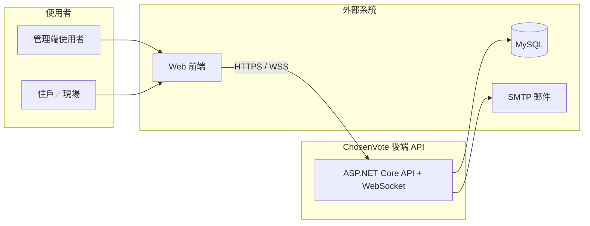

| 項目 | 說明 |
|------|------|
| 文件版本 | 1.0 |
| 文件類型 | Software Architecture（軟體架構／解決方案架構） |
| 對應程式 | `code/slnChosenVoteApi.sln` |
| 關聯文件 | `document/SD-天選選務系統-後端API系統設計.md`（模組與流程細節） |
| 需求與分析 | `document/專案分析彙整.md`、`document/004_202409_合滙_天選選務系統` |

---

## 1. 文件目的與定位

### 1.1 SA 與 SD 之分工

| 文件 | 重點 |
|------|------|
| **本文件（SA）** | 為何如此建置：業務情境、架構視角、技術決策、品質屬性、部署與風險。 |
| **SD** | 如何實作：分層、Controller／Service、資料表對應、關鍵流程步驟。 |

讀者若需查 API 模組或資料表對應，請以 **SD** 為主；若需向利害關係人說明整體架構與取捨，請以 **本文件** 為主。

### 1.2 範圍

- **包含**：後端解決方案邊界、與外部系統關係、架構原則、技術選型理由（簡述）、品質與風險。
- **不包含**：逐支 API 規格（請用 Swagger）；資料表欄位級說明（請用 `ChosenVote-schema.sql` 與 SD）。

---

## 2. 業務與問題領域

### 2.1 系統使命

支援 **區分所有權人會議／選務** 之數位化：會議建立、現場報到（含 QRCode 與委託）、議案與選舉投票、開議／決議額數、會議結束後資料固化，並提供管理端與住戶端即時協作能力。

### 2.2 核心領域概念

- **社區與組織**：多社區、多角色管理。
- **會議與流程**：可設定流程步驟；現場與「正式結案」資料分離（Live 雙軌）。
- **投票與稽核**：防重複投票、必要時鎖定與紀錄。

---

## 3. 利害關係人

| 利害關係人 | 關注點 |
|------------|--------|
| 社區／管委／選務人員 | 操作正確性、現場順暢、報表與匯出 |
| 住戶 | 報到與投票是否直覺、身分與委託是否合規 |
| 開發／維運 | 可維護性、除錯、部署與設定管理 |
| 資安／法遵 | 個資、操作軌跡、設定與金鑰管理 |

---

## 4. 系統情境（架構層級）

### 4.1 情境圖（C4：系統情境）

- **前端** 不在本 repo 內，但透過 HTTP(S) 與 WebSocket 與後端整合。
- **後端** 為單一部署單元（單一 Web 應用程式），內含 REST 與 WebSocket。

### 4.2 解決方案容器（邏輯上）

| 容器 | 技術 | 職責 |
|------|------|------|
| ChosenVoteApi | .NET 8 | HTTP API、WebSocket、DI、中介軟體 |
| Repository 專案 | Dapper | 資料存取抽象 |
| Model 專案 | POCO／DTO | 領域與傳輸模型 |
| Utilities 專案 | 靜態輔助 | 加解密、JWT、驗證等 |

---

## 5. 架構原則與風格

| 原則 | 說明 |
|------|------|
| **分層** | Controller 不直接寫 SQL；業務集中於 Service；Repository 僅資料存取。 |
| **Live 與正式分離** | 現場操作主要寫入 `*live` 表，結束會議時再回寫正式表，降低正式資料在進行中被破壞的風險。 |
| **一致性以交易為中心** | 跨表更新由 Service 使用交易（Dapper／連線層）包裝；DB 層 FK 未全面建立時更依賴此模式。 |
| **可觀測性** | API 存取、Socket、錯誤、郵件等多有對應紀錄表或日誌。 |

---

## 6. 技術決策摘要

| 決策 | 選擇 | 理由（簡述） |
|------|------|----------------|
| Web 框架 | ASP.NET Core | 跨平台、效能與生態成熟 |
| 資料存取 | Dapper + 手寫 SQL | 效能與 SQL 可控，適合既有複雜查詢 |
| 驗證 | JWT Bearer | 無狀態、適合前後端分離 |
| 即時 | WebSocket（內建） | 會議步驟與畫面同步需求 |
| 文件 | Swagger | 開發與串接效率 |
| 日誌 | NLog | 與 .NET 整合常見 |

---

## 7. 品質屬性（Architecture Qualities）

| 屬性 | 目標 | 現況與備註 |
|------|------|------------|
| **正確性** | 投票不重複、額數計算可追溯 | DB unique、`votelock`、額數 JSON 與 Service 邏輯並存 |
| **安全性** | 身分驗證、最小權限、機密不外洩 | JWT 已採用；CORS 與設定檔密文須持續收斂 |
| **可維護性** | 模組邊界清楚 | 分層與專案切割清楚；建議補測試與靜態分析 |
| **可用性** | 會議現場不中斷 | 依部署與 DB 高可用策略而定（本文件不規範硬體 SLA） |

---

## 8. 部署與環境（概念）

- **執行**：以 Kestrel 或反向代理（IIS／Nginx 等）後方執行為典型模式。
- **設定**：`appsettings.json`／環境變數；**建議** 正式環境將連線字串、JWT、SMTP 外移。
- **資料庫**：單一 MySQL 實例為常見假設；若需讀寫分離，須另行設計 Repository 路由（目前未見）。

---

## 9. 已知限制與架構風險

| 項目 | 說明 |
|------|------|
| 資料庫 FK 不完整 | 關聯多靠應用層；重構或批次工具須格外謹慎。 |
| CORS 全開 | 對外公開網路環境風險較高，建議改白名單。 |
| 機密在設定檔 | 版本庫與權限管理需配套。 |
| 測試與 CI | 架構上可測，但專案內自動化測試基線仍弱。 |

---

## 10. 演進方向（架構視角）

1. **Secrets 管理**：環境變數／Azure Key Vault／K8s Secret 等標準化。
2. **測試金字塔**：Repository 整合測試 + 核心 Service 單元測試。
3. **API 版本化**：若對外整合方增加，可考慮 `/api/v1` 或標頭版本策略。
4. **即時層擴充**：若連線數大增，可評估獨立 SignalR／訊息佇列（現階段非必要）。

---

## 11. 文件修訂紀錄

| 版本 | 日期 | 說明 |
|------|------|------|
| 1.0 | 2026-04-15 | 初版：與 SD、專案分析文件配套 |
